# CMREF — Analyse MERISE Complète

> Document généré automatiquement — Analyse du système de gestion de distribution éducative **Ajial Medias / MSM-MEDIAS**

---

## 1. Présentation du Projet

### 1.1 Objectif de l'Application

CMREF (Centre de Management de Représentants et de Formation) est un système de gestion intégré pour une entreprise éducative marocaine spécialisée dans l'édition, la distribution et la robotique scolaire. Le système gère le cycle complet de la distribution de livres scolaires :

- **Approvisionnement** auprès des fournisseurs (imprimeurs)
- **Allocation** aux représentants territoriaux
- **Vente** aux clients (écoles, librairies)
- **Encaissement** des paiements
- **Suivi financier** et comptable

### 1.2 Objectifs Principaux

| # | Objectif | Description |
|---|---|---|
| 1 | Gestion du cycle de vie des livres | Du catalogue à la vente, en passant par la livraison et le dépôt |
| 2 | Gestion des représentants | Suivi territorial, allocation de stock, suivi des paiements |
| 3 | Gestion des fournisseurs | BL d'entrée, paiements, synthèses |
| 4 | Facturation | Demande de facturation, transformation en facture, suivi des paiements |
| 5 | Traçabilité | Historique complet des opérations par client et par représentant |
| 6 | Reporting | Synthèses globales, balance financière, rapports par catégorie |
| 7 | Communication | Envoi d'e-mails, invitations, cahiers de texte, cartes de visite |

### 1.3 Acteurs du Système

| Acteur | Rôle | Description |
|---|---|---|
| **Administrateur** (SAFE) | Gestionnaire central | Gère les représentants, fournisseurs, paramètres, saison, et supervise toutes les opérations |
| **Représentant** (REP) | Agent terrain | Gère ses clients, passe des BL, enregistre les paiements, déclare les dépôts |
| **Système** | Automatisé | Gère l'authentification, le filtrage par saison, l'audit logging |

### 1.4 Périmètre du Système

```
┌─────────────────────────────────────────────────────────────────┐
│                        CMREF — Périmètre                        │
├─────────────────────────────────────────────────────────────────┤
│  Frontend: React 19 + Zustand + Tailwind CSS                    │
│  Backend:  Laravel 12 + Sanctum + Spatie Activity Log           │
│  Base de données: MySQL (UUID primary keys)                     │
│  PDF: @react-pdf/renderer                                       │
│  Auth: Token-based (Sanctum) + polymorphic Login                │
└─────────────────────────────────────────────────────────────────┘
```

---

## 2. Analyse des Acteurs

### 2.1 Administrateur (SAFE)

| Aspect | Détail |
|---|---|
| **Responsabilités** | Gestion complète du système, supervision des opérations |
| **Permissions** | CRUD sur toutes les entités, activation des saisons, envoi d'e-mails, invitations |
| **Modules accessibles** | Tous (37 pages admin) |
| **Portail** | `/dash/*` |

**Modules administrables :**

- Livres (Catégories, Catalogue)
- Fournisseurs (Disponibles, BL, Remboursement, Synthèses)
- Représentants (Disponibles, BL, Remboursement, Facturation, Dépôt, Cahier, Cartes, Synthèses)
- Robots
- Traçabilité (Clients, BL Clients, Remboursement Client, Synthèse, Activité)
- Synthèses Globales (7 rapports)
- Emailing (Email simple, Invitation)
- Réglages (Saison, Pied de facture, Modèles cahier)

### 2.2 Représentant (REP)

| Aspect | Détail |
|---|---|
| **Responsabilités** | Gestion de son portefeuille clients, ventes, encaissements |
| **Permissions** | CRUD sur ses propres données (clients, BL, remboursements, dépôts, robots). Lecture seule sur les données de référence |
| **Modules accessibles** | 18 pages REP |
| **Portail** | `/REP/dash/*` |
| **Filtrage données** | `ScopedByRepresentant` — ne voit que ses propres enregistrements |

**Modules accessibles :**

- Bon de Livraison (BL, Remboursement, Synthèse)
- Factures (MSM-Medias, Wataniya)
- Clients (Ajouter, Saisir BL, Remboursement, Synthèses)
- Dépôt
- Cahier de texte (Commander, Suivi)
- Cartes de visite (Commander, Suivi)
- Robots
- Profil

### 2.3 Fournisseur (Imprimeur)

| Aspect | Détail |
|---|---|
| **Responsabilités** | Fournir les livres imprimés à MSM-MEDIAS |
| **Permissions** | Aucun accès au système (géré par l'admin) |
| **Middleware** | `EnsureUserIsSupplier` existe mais n'est pas encore appliqué aux routes |

---

## 3. Décomposition Fonctionnelle

### 3.1 Arbre des Modules

```
CMREF
├── Authentification
│   ├── Connexion (username + password + année scolaire)
│   ├── Déconnexion
│   └── Gestion de session (24h auto-expire)
│
├── Catalogue de Livres
│   ├── Catégories (Primaire, Collège, Lycée, Préscolaire, Robotos)
│   ├── Livres (titre, code, prix_achat, prix_vente, prix_public)
│   └── Catalogues (présentation visuelle)
│
├── Gestion des Saisons
│   ├── CRUD saisons
│   ├── Activation/désactivation
│   └── Filtrage automatique des données
│
├── Fournisseurs (Imprimeurs)
│   ├── CRUD fournisseurs
│   ├── BL d'entrée (Fournisseur → MSM-MEDIAS)
│   ├── Paiements aux fournisseurs
│   └── Synthèses (BL, Remboursement)
│
├── Représentants
│   ├── CRUD représentants (+ création Login)
│   ├── BL de sortie (MSM-MEDIAS → Représentant)
│   ├── Paiements des représentants
│   ├── Facturation (Demande → Transformation → Facture)
│   ├── Dépôt (déclaration de stock)
│   ├── Cahier de texte (commande de supports pédagogiques)
│   ├── Cartes de visite & Chevalet
│   └── Synthèses (BL, Remboursement)
│
├── Clients
│   ├── CRUD clients
│   ├── BL clients (Ventes)
│   ├── Paiements clients
│   └── Synthèses (BL, Remboursement)
│
├── Facturation
│   ├── Séquences de facturation
│   ├── Lignes de facture
│   ├── Statuts (Brouillon → Validée → Payée / Annulée)
│   └── TVA (20%)
│
├── Robots (Robotique éducative)
│   ├── Suivi des visites
│   ├── Établissements scolaires
│   └── Statuts (Placé, Démonstration, Retourné, Vendu)
│
├── Reporting & Synthèses
│   ├── Balance financière
│   ├── Livraison Fournisseurs → MSM-MEDIAS
│   ├── Livraison MSM-MEDIAS → Représentants
│   ├── Ventes globales
│   ├── Dépôt global
│   ├── Remboursement Fournisseurs
│   ├── Remboursement Représentants
│   └── Rapports PDF (13 composants)
│
├── Communication
│   ├── Envoi d'e-mails
│   ├── Invitations
│   └── Logs d'activité (Spatie)
│
└── Réglages
    ├── Saison de travail
    ├── Pied de facture
    └── Modèles cahier de texte
```

---

## 4. Diagramme de Cas d'Utilisation

```mermaid
flowchart TB
    subgraph Admin["Administrateur (SAFE)"]
        A1[Gérer les livres et catégories]
        A2[Gérer les fournisseurs]
        A3[Saisir BL fournisseur]
        A4[Payer les fournisseurs]
        A5[Gérer les représentants]
        A6[Saisir BL représentant]
        A7[Recevoir paiements représentants]
        A8[Transformer demande → facture]
        A9[Gérer les saisons]
        A10[Envoyer des e-mails]
        A11[Consulter les synthèses]
        A12[Voir la balance financière]
        A13[Gérer les robots]
        A14[Gérer les paramètres]
    end

    subgraph REP["Représentant (REP)"]
        R1[Gérer ses clients]
        R2[Saisir BL client]
        R3[Enregistrer paiements clients]
        R4[Déclarer des dépôts]
        R5[Demander une facturation]
        R6[Commander cahier de texte]
        R7[Commander cartes de visite]
        R8[Suivre ses BL]
        R9[Suivre ses remboursements]
        R10[Enregistrer robot]
        R11[Consulter ses synthèses]
    end

    subgraph System["Système"]
        S1[Authentification]
        S2[Filtrage par saison]
        S3[Filtrage par représentant]
        S4[Audit logging]
        S5[Génération PDF]
    end

    Admin --> A1 & A2 & A3 & A4 & A5 & A6 & A7 & A8 & A9 & A10 & A11 & A12 & A13 & A14
    REP --> R1 & R2 & R3 & R4 & R5 & R6 & R7 & R8 & R9 & R10 & R11
    System --> S1 & S2 & S3 & S4 & S5
```

---

## 5. Analyse des Processus Métier

### 5.1 Création d'un Bon de Livraison (BL) Fournisseur

| Élément | Description |
|---|---|
| **Déclencheur** | Réception physique de livres d'un imprimeur |
| **Entrées** | Fournisseur, date de réception, numéro BL, articles (livre + quantité) |
| **Sorties** | BL enregistré, stock mis à jour |
| **Règles de validation** | Au moins 1 article, chaque article doit référencer un livre existant, quantité > 0 |
| **Flux** | Admin saisit BL → Sélection articles par catégorie → Quantités → Soumet → Stock interne incrémenté |

### 5.2 Création d'un BL Représentant

| Élément | Description |
|---|---|
| **Déclencheur** | Allocation de stock à un représentant |
| **Entrées** | Représentant, date d'émission, mode d'envoi, type (Livre/Specimen/Pedagogie/Retour), articles |
| **Sorties** | BL enregistré, débit du stock interne |
| **Règles de validation** | Type valide, au moins 1 article, représentant actif |
| **Flux** | Admin/REP sélectionne articles → Quantités → Type → Soumet → BL créé |

### 5.3 Vente Client (BL Client)

| Élément | Description |
|---|---|
| **Déclencheur** | Vente de livres à un client par le représentant |
| **Entrées** | Client, articles, quantités, remise (%) |
| **Sorties** | BVente enregistrée |
| **Règles de validation** | Client valide, au moins 1 article, remise 0-50% |
| **Flux** | REP sélectionne client → Articles → Quantités + Remise → Soumet |

### 5.4 Transformation Demande → Facture

| Élément | Description |
|---|---|
| **Déclencheur** | Validation d'une demande de facturation |
| **Entrées** | Demande de facturation (demande_f) |
| **Sorties** | Facture (fact) + lignes (det_fact) |
| **Règles** | Une demande ne peut être transformée qu'une seule fois (`livree=1`), auto-génération du numéro (`FACT/YY-YY/NNNN`), TVA 20% |
| **Flux** | Admin valide demande → Transform → Facture créée en statut "Brouillon" |

### 5.5 Enregistrement d'un Paiement

| Élément | Description |
|---|---|
| **Déclencheur** | Réception d'un chèque ou virement |
| **Entrées** | Bénéficiaire, date, banque, numéro chèque, montant, type de versement |
| **Sorties** | Paiement enregistré |
| **Règles** | Montant valide > 0, banque valide si fournie |
| **Types de versement** | En main propre, Virement, Versement |
| **Statuts** | Reçu, Accepté, Rejeté |

### 5.6 Déclaration de Dépôt

| Élément | Description |
|---|---|
| **Déclencheur** | Déclaration de stock invendu chez un représentant |
| **Entrées** | Représentant, livre, quantité |
| **Sorties** | Ligne de dépôt créée |
| **Règles** | Une seule ligne par (représentant, livre), quantité ≥ 0 |
| **Contrainte** | Unique sur `(rep_id, livre_id)` |

---

## 6. Diagrammes de Flux de Données (DFD)

### 6.1 Niveau 0 — Vue d'ensemble

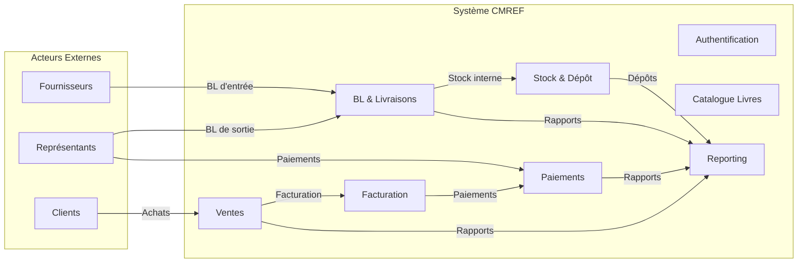

### 6.2 Niveau 1 — Flux Détailés

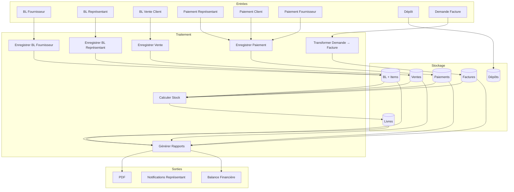

---

## 7. Modèle Conceptuel de Données (MCD)

```mermaid
erDiagram
    DESTINATION ||--o{ REPRESENTANT : "a des"
    REPRESENTANT ||--o{ CLIENT : "gère"
    REPRESENTANT ||--o{ BL_LIVRAISON : "reçoit"
    REPRESENTANT ||--o{ B_VENTE_CLIENT : "réalise"
    REPRESENTANT ||--o{ DEPOT : "déclare"
    REPRESENTANT ||--o{ REP_REMBOURSEMENT : "paie"
    REPRESENTANT ||--o{ CLIENT_REMBOURSEMENT : "encaisse"
    REPRESENTANT ||--o{ DEMANDE_F : "demande"
    REPRESENTANT ||--o{ CARTE_VISITE : "commande"
    REPRESENTANT ||--o{ CAHIER_COMMUNICATION : "commande"
    REPRESENTANT ||--o{ ROBOT : "déplace"

    IMPRIMEUR ||--o{ BL_LIVRAISON_IMP : "livre"
    IMPRIMEUR ||--o{ REMB_IMP : "est payé"

    CATEGORIE ||--o{ LIVRE : "contient"
    CATEGORIE ||--o{ CATALOGUE : "présente"

    LIVRE ||--o{ BL_LIVRAISON_ITEM : "est livré"
    LIVRE ||--o{ DET_FACT : "est facturé"
    LIVRE ||--o{ DEPOT : "est en dépôt"
    LIVRE ||--o{ B_VENTE_CLIENT : "est vendu"

    CLIENT ||--o{ B_VENTE_CLIENT : "achète"
    CLIENT ||--o{ CLIENT_REMBOURSEMENT : "paie"
    CLIENT ||--o{ DEMANDE_F : "est facturé"

    SAISON ||--o{ BL_LIVRAISON : "appartient"
    SAISON ||--o{ BL_LIVRAISON_IMP : "appartient"
    SAISON ||--o{ B_VENTE_CLIENT : "appartient"
    SAISON ||--o{ REP_REMBOURSEMENT : "appartient"
    SAISON ||--o{ CLIENT_REMBOURSEMENT : "appartient"
    SAISON ||--o{ DEMANDE_F : "appartient"
    SAISON ||--o{ FACT : "appartient"
    SAISON ||--o{ DEPOT : "appartient"

    DEMANDE_F ||--o| FACT : "transformée en"
    FACT ||--o{ DET_FACT : "contient"
    FACT ||--o{ REP_REMBOURSEMENT : "est payée par"
    FACT_SEQUENCE ||--o{ FACT : "numérote"

    BANQUE ||--o{ REP_REMBOURSEMENT : "émise par"
    BANQUE ||--o{ CLIENT_REMBOURSEMENT : "émise par"
    BANQUE ||--o{ REMB_IMP : "émise par"

    DESTINATION {
        uuid id PK
        string destination
        string description
    }

    REPRESENTANT {
        uuid id PK
        uuid destination_id FK
        string nom
        string cin UK
        string tel
        string email UK
        string login UK
        string password
        int bl_count
        int remb_count
    }

    CLIENT {
        uuid id PK
        uuid representant_id FK
        uuid destination_id FK
        string raison_sociale
        string ice
        string ville
        string tel
        string email
    }

    CATEGORIE {
        uuid id PK
        string libelle
        string description
    }

    LIVRE {
        uuid id PK
        string titre
        string code UK
        uuid categorie_id FK
        decimal prix_achat
        decimal prix_vente
        decimal prix_public
    }

    IMPRIMEUR {
        uuid id PK
        string raison_sociale
        string directeur_nom
        string directeur_tel
    }

    SAISON {
        uuid id PK
        string name
        date start_date
        date end_date
        boolean is_active
    }

    BL_LIVRAISON {
        uuid id PK
        uuid rep_id FK
        uuid season_id FK
        string bl_number
        date date_emission
        string type
        string status
    }

    BL_LIVRAISON_IMP {
        uuid id PK
        uuid imprimeur_id FK
        uuid season_id FK
        date date_reception
        string b_livraison_number
    }

    BL_LIVRAISON_ITEM {
        uuid id PK
        uuid deliverable_id FK
        string deliverable_type
        uuid livre_id FK
        int quantite
    }

    B_VENTE_CLIENT {
        uuid id PK
        uuid rep_id FK
        uuid client_id FK
        uuid livre_id FK
        string b_vente_number
        date date_vente
        int quantite
        decimal remise
    }

    DEPOT {
        uuid id PK
        uuid rep_id FK
        uuid livre_id FK
        int quantite_balance
        int status
    }

    DEMANDE_F {
        uuid id PK
        uuid rep_id FK
        uuid client_id FK
        date date_demande
        string type
        int statut
        int livree
        text contenu
    }

    FACT_SEQUENCE {
        uuid id PK
        string nom UK
        int dernier_numero
        boolean est_active
    }

    FACT {
        uuid id PK
        uuid rep_id FK
        uuid sequence_id FK
        uuid demande_id FK
        string fact_number UK
        date date_facture
        decimal total_ht
        decimal tva_rate
        decimal total_ttc
        decimal reste_a_payer
        string status
    }

    DET_FACT {
        uuid id PK
        uuid fact_id FK
        uuid livre_id FK
        int quantite
        decimal prix_unitaire_ht
        decimal remise
        decimal total_ligne_ht
    }

    REP_REMBOURSEMENT {
        uuid id PK
        uuid rep_id FK
        uuid fact_id FK
        uuid banque_id FK
        date date_payment
        string cheque_number
        string type_versement
        decimal montant
        boolean statut_recu
        boolean statut_rejete
        boolean statut_accepte
    }

    CLIENT_REMBOURSEMENT {
        uuid id PK
        uuid rep_id FK
        uuid client_id FK
        uuid banque_id FK
        date date_payment
        string cheque_number
        decimal montant
        string a_lordre_de
    }

    REMB_IMP {
        uuid id PK
        uuid imprimeur_id FK
        uuid banque_id FK
        date date_payment
        string cheque_number
        decimal montant
        boolean statut_recu
        boolean statut_rejete
    }

    BANQUE {
        uuid id PK
        string nom
        string code_abreviation
        boolean is_active
    }

    CARTE_VISITE {
        uuid id PK
        uuid rep_id FK
        string model
        date date_commande
        string nom_sur_carte
        boolean is_valide_carte
        boolean is_valide_chevalet
    }

    CAHIER_COMMUNICATION {
        uuid id PK
        uuid rep_id FK
        string ecole
        string type
        int qte
        date date_commande
        boolean is_accepted
        boolean is_printed
        boolean is_delivered
    }

    ROBOT {
        uuid id PK
        uuid rep_id FK
        uuid destination_id FK
        date date_operation
        string ville
        string etablissement
        string reference_robot
        string statut
    }

    LOGIN {
        uuid id PK
        string username UK
        string password
        uuid authenticatable_id FK
        string authenticatable_type
        string role
        boolean is_active
    }

    EMAIL_LOG {
        uuid id PK
        string destinataire
        string sujet
        string type
        string statut
    }

    INVITATION {
        uuid id PK
        string email
        string role
        string token UK
        timestamp expires_at
        string statut
    }

    SETTING {
        uuid id PK
        string key UK
        text value
        string type
    }
```

---

## 8. Modèle Logique de Données (MLD)

```mermaid
erDiagram
    destinations {
        uuid id PK
        string destination
        string description
    }

    representants {
        uuid id PK
        uuid destination_id FK
        string nom
        string cin UK
        string tel
        string email UK
        string login UK
        string password
        int bl_count
        int remb_count
    }

    clients {
        uuid id PK
        uuid representant_id FK
        uuid destination_id FK
        string raison_sociale
        string ice
        string ville
        string tel
        string email
    }

    categories {
        uuid id PK
        string libelle
        string description
    }

    livres {
        uuid id PK
        string titre
        string code UK
        uuid categorie_id FK
        decimal prix_achat
        decimal prix_vente
        decimal prix_public
    }

    imprimeurs {
        uuid id PK
        string raison_sociale
        string adresse
        string directeur_nom
        string directeur_tel
    }

    seasons {
        uuid id PK
        string name
        date start_date
        date end_date
        boolean is_active
    }

    b_livraisons {
        uuid id PK
        uuid rep_id FK
        uuid season_id FK
        string bl_number
        date date_emission
        string type
        string status
    }

    b_livraison_imps {
        uuid id PK
        uuid imprimeur_id FK
        uuid season_id FK
        date date_reception
        string b_livraison_number
    }

    b_livraison_items {
        uuid id PK
        uuid deliverable_id FK
        string deliverable_type
        uuid livre_id FK
        int quantite
    }

    b_ventes_clients {
        uuid id PK
        uuid rep_id FK
        uuid client_id FK
        uuid livre_id FK
        string b_vente_number
        date date_vente
        int quantite
        decimal remise
    }

    depots {
        uuid id PK
        uuid rep_id FK
        uuid livre_id FK
        int quantite_balance
        int status
    }

    demande_f {
        uuid id PK
        uuid rep_id FK
        uuid client_id FK
        date date_demande
        string type
        int statut
        int livree
        text contenu
    }

    fact_sequences {
        uuid id PK
        string nom UK
        int dernier_numero
        boolean est_active
    }

    fact {
        uuid id PK
        uuid rep_id FK
        uuid sequence_id FK
        uuid demande_id FK
        string fact_number UK
        date date_facture
        decimal total_ht
        decimal tva_rate
        decimal total_ttc
        decimal reste_a_payer
        string status
    }

    det_fact {
        uuid id PK
        uuid fact_id FK
        uuid livre_id FK
        int quantite
        decimal prix_unitaire_ht
        decimal remise
        decimal total_ligne_ht
    }

    rep_remboursements {
        uuid id PK
        uuid rep_id FK
        uuid fact_id FK
        uuid banque_id FK
        date date_payment
        string cheque_number
        string type_versement
        decimal montant
        boolean statut_recu
        boolean statut_rejete
        boolean statut_accepte
    }

    client_remboursements {
        uuid id PK
        uuid rep_id FK
        uuid client_id FK
        uuid banque_id FK
        date date_payment
        string cheque_number
        decimal montant
        string a_lordre_de
    }

    remb_imps {
        uuid id PK
        uuid imprimeur_id FK
        uuid banque_id FK
        date date_payment
        string cheque_number
        decimal montant
        boolean statut_recu
        boolean statut_rejete
    }

    banques {
        uuid id PK
        string nom
        string code_abreviation
        boolean is_active
    }

    logins {
        uuid id PK
        string username UK
        string password
        uuid authenticatable_id FK
        string authenticable_type
        string role
        boolean is_active
    }

    carte_visites {
        uuid id PK
        uuid rep_id FK
        string model
        date date_commande
        string nom_sur_carte
        boolean is_valide_carte
        boolean is_valide_chevalet
    }

    cahier_communications {
        uuid id PK
        uuid rep_id FK
        string ecole
        string type
        int qte
        date date_commande
        boolean is_accepted
        boolean is_printed
        boolean is_delivered
    }

    robots {
        uuid id PK
        uuid rep_id FK
        uuid destination_id FK
        date date_operation
        string ville
        string etablissement
        string reference_robot
        string statut
    }

    email_logs {
        uuid id PK
        string destinataire
        string sujet
        string message
        string type
        string statut
    }

    invitations {
        uuid id PK
        string email
        string role
        string token UK
        timestamp expires_at
        string statut
    }

    settings {
        uuid id PK
        string key UK
        text value
        string type
    }
```

---

## 9. Modèle Physique de Données (MPD)

### 9.1 Contraintes d'Intégrité

| Table | Contrainte | Type |
|---|---|---|
| `representants.cin` | UNIQUE | Alternate key |
| `representants.login` | UNIQUE | Login uniqueness |
| `livres.code` | UNIQUE | Book code |
| `fact.fact_number` | UNIQUE | Invoice number |
| `fact.(year_session, number)` | UNIQUE COMPOSITE | Invoice per session |
| `depots.(rep_id, livre_id)` | UNIQUE COMPOSITE | One depot line per book per rep |
| `logins.username` | UNIQUE | Login uniqueness |
| `seasons.is_active` | INDEX | Active season lookup |
| `invitations.token` | UNIQUE | Invitation token |
| `settings.key` | UNIQUE | Setting key |

### 9.2 Clés Étrangères

| Table | Colonne | Référence | ON DELETE |
|---|---|---|---|
| `representants` | `destination_id` | `destinations.id` | SET NULL |
| `clients` | `representant_id` | `representants.id` | CASCADE |
| `clients` | `destination_id` | `destinations.id` | SET NULL |
| `livres` | `categorie_id` | `categories.id` | SET NULL |
| `b_livraisons` | `rep_id` | `representants.id` | CASCADE |
| `b_livraisons` | `season_id` | `seasons.id` | SET NULL |
| `b_livraison_imps` | `imprimeur_id` | `imprimeurs.id` | CASCADE |
| `b_livraison_items` | `livre_id` | `livres.id` | SET NULL |
| `b_ventes_clients` | `rep_id` | `representants.id` | CASCADE |
| `b_ventes_clients` | `client_id` | `clients.id` | CASCADE |
| `depots` | `rep_id` | `representants.id` | CASCADE |
| `depots` | `livre_id` | `livres.id` | CASCADE |
| `fact` | `rep_id` | `representants.id` | CASCADE |
| `fact` | `sequence_id` | `fact_sequences.id` | SET NULL |
| `fact` | `demande_id` | `demande_f.id` | SET NULL |
| `det_fact` | `fact_id` | `fact.id` | CASCADE |
| `det_fact` | `livre_id` | `livres.id` | SET NULL |
| `rep_remboursements` | `rep_id` | `representants.id` | CASCADE |
| `rep_remboursements` | `fact_id` | `fact.id` | SET NULL |
| `rep_remboursements` | `banque_id` | `banques.id` | SET NULL |
| `client_remboursements` | `rep_id` | `representants.id` | CASCADE |
| `client_remboursements` | `client_id` | `clients.id` | CASCADE |
| `client_remboursements` | `banque_id` | `banques.id` | SET NULL |
| `remb_imps` | `imprimeur_id` | `imprimeurs.id` | CASCADE |
| `remb_imps` | `banque_id` | `banques.id` | SET NULL |

### 9.3 Index Recommandés

| Table | Index | Colonne(s) | Raison |
|---|---|---|---|
| `b_livraisons` | `idx_bl_rep_season` | `rep_id, season_id` | Filtrage par représentant et saison |
| `b_livraison_imps` | `idx_bli_imp_season` | `imprimeur_id, season_id` | Filtrage par fournisseur et saison |
| `b_ventes_clients` | `idx_bvc_rep_season` | `rep_id, season_id` | Filtrage par représentant et saison |
| `fact` | `idx_fact_rep_season` | `rep_id, season_id` | Filtrage par représentant et saison |
| `rep_remboursements` | `idx_rr_rep_season` | `rep_id, season_id` | Filtrage par représentant et saison |
| `depots` | `idx_depot_rep` | `rep_id` | Filtrage par représentant |
| `activity_log` | `idx_al_log_name` | `log_name` | Audit trail lookup |
| `activity_log` | `idx_al_subject` | `subject_type, subject_id` | Entity audit lookup |

---

## 10. Diagrammes d'États

### 10.1 Cycle de Vie d'une Facture

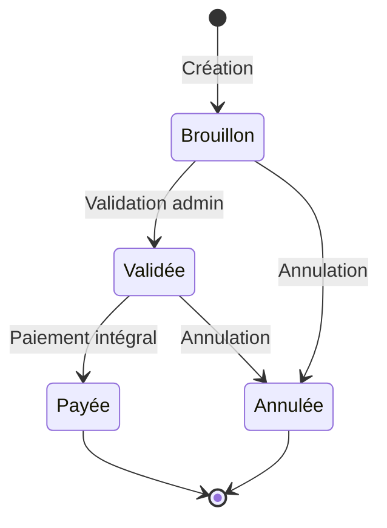

### 10.2 Cycle de Vie d'un BL Représentant

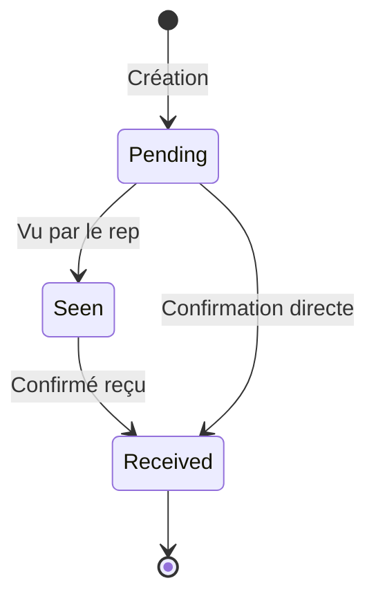

### 10.3 Cycle de Vie d'une Demande de Facturation

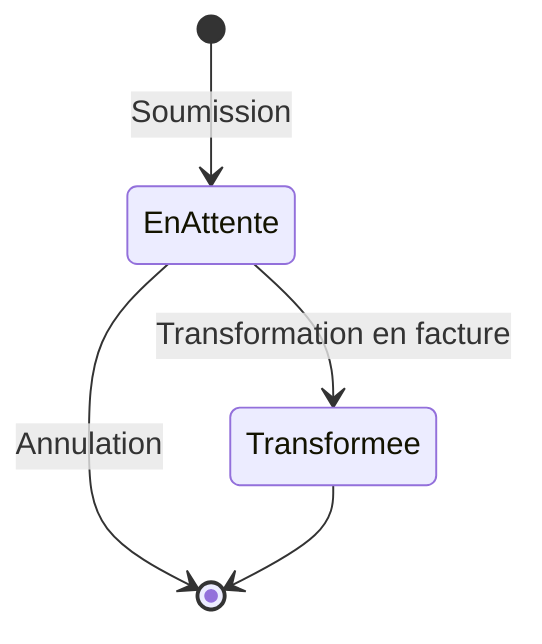

### 10.4 Cycle de Vie d'un Paiement

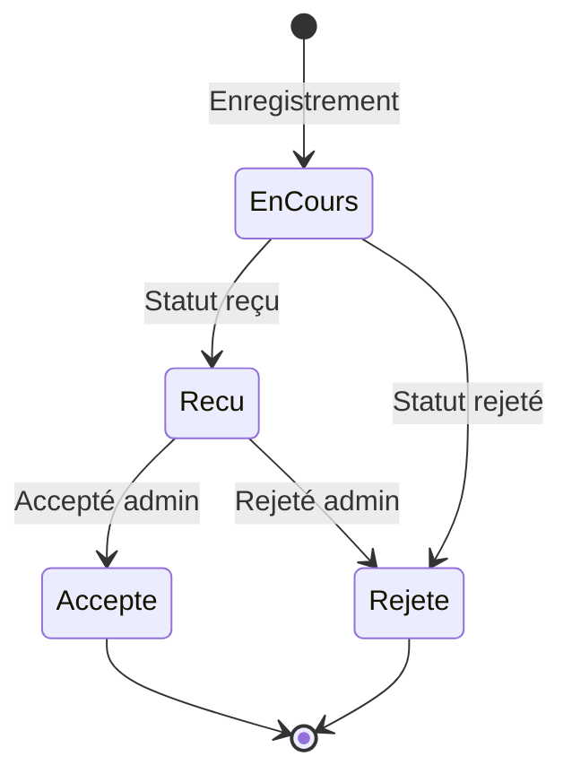

### 10.5 Cycle de Vie d'un Robot

```marmaid
stateDiagram-v2
    [*] --> Place: Installation
    Place --> Demonstration: Démonstration
    Demonstration --> Vendu: Vente
    Demonstration --> Retourne: Retour
    Place --> Retourne: Retour
    Retourne --> [*]
    Vendu --> [*]
```

### 10.6 Cycle de Vie d'une Carte de Visite

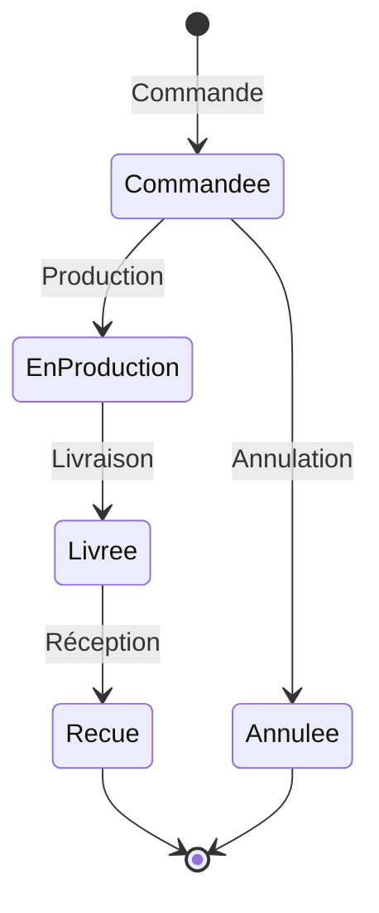

---

## 11. Diagrammes de Séquence

### 11.1 Authentification

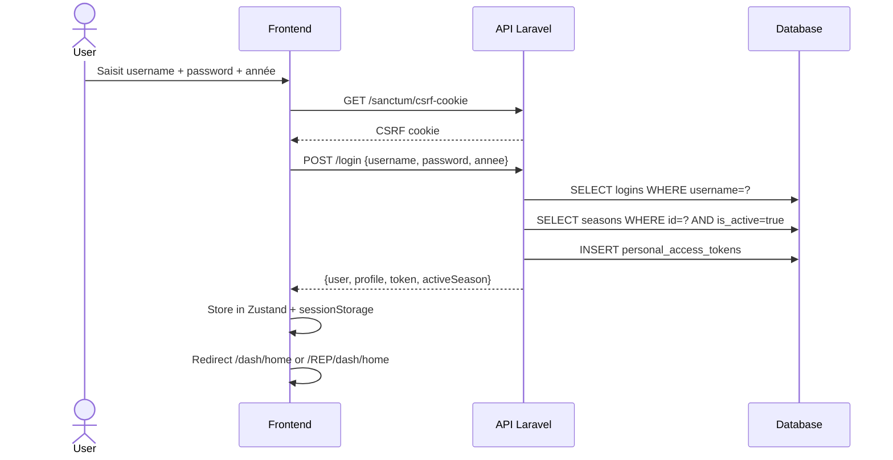

### 11.2 Création d'un BL Fournisseur

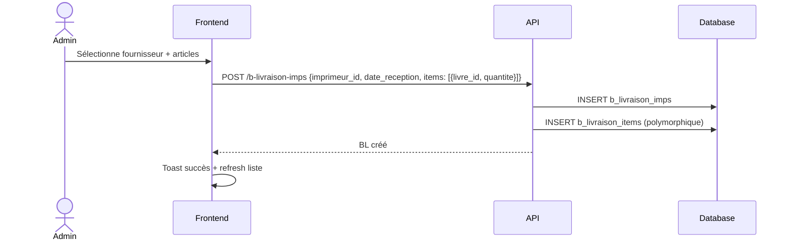

### 11.3 Transformation Demande → Facture

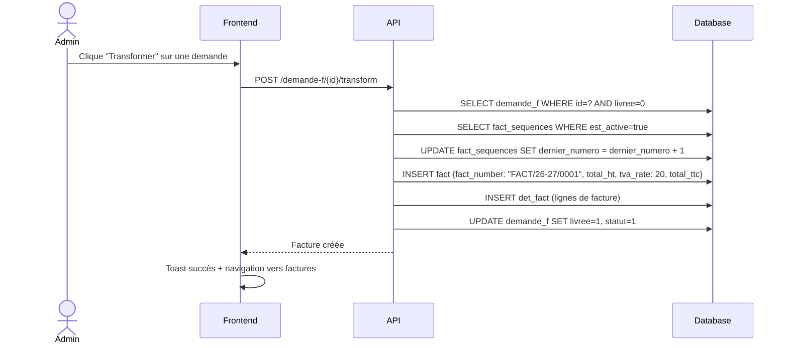

### 11.4 Génération PDF

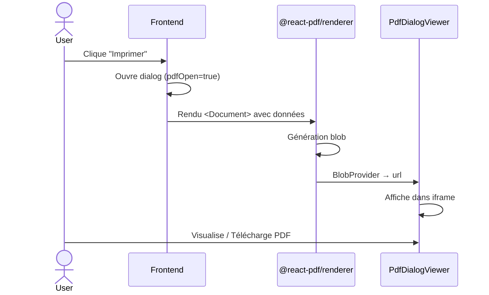

---

## 12. Analyse des Dépendances

### 12.1 Dépendances entre Modules

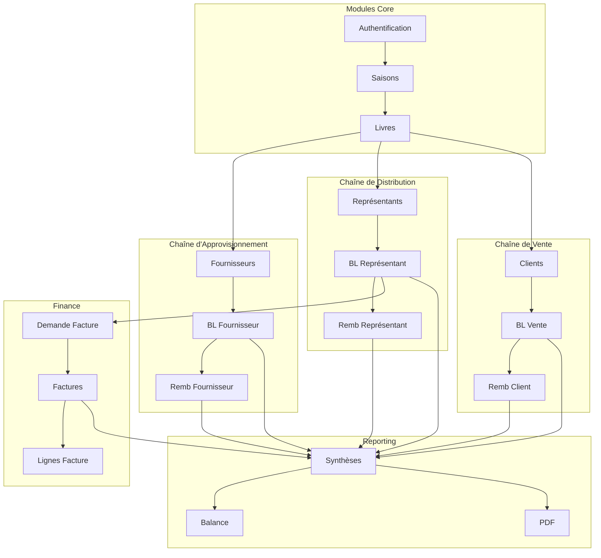

### 12.2 Points de Couplage Critiques

| Couplé | Type | Risque |
|---|---|---|
| `b_livraison_items.deliverable_type/id` | Polymorphique sans FK formel | Intégrité vérifiée par l'application uniquement |
| `logins.authenticatable_type/id` | Polymorphique | Un seul point d'authentification pour admin + rep |
| `seasons.is_active` | Flag unique | Un seul actif à la fois — race condition possible |
| `ScopedByRepresentant` | Trait global scope | Tout modèle transactionnel en dépend |
| `FilterBySeason` | Trait global scope | Tout modèle transactionnel en dépend |

---

## 13. Analyse des Risques

### 13.1 Modules Manquants

| Module | Statut | Impact |
|---|---|---|
| Portail Fournisseur | Middleware existe, aucune route | Fournisseur ne peut pas voir ses BL/paiements |
| Page Profil REP | TODO dans le code | Le REP ne peut pas changer son mot de passe |
| Page `RemboursementFacturesPage` | Orpheline (pas dans les routes) | Inutilisable |
| Page Email/Invitation | Bannière "Intégration API à finaliser" | Envoi d'e-mails non fonctionnel |
| Page Pied de Facture | Bannière "Intégration API à finaliser" | Paramétrage de la facture non fonctionnel |

### 13.2 Risques Métier

| Risque | Description | Mitigation |
|---|---|---|
| Race condition saison | Deux admins activent des saisons simultanément | Verrou en base ou transaction |
| BL sans saison | `season_id` nullable sur plusieurs tables | Filtrage par saison peut retourner des données incomplètes |
| Montant négatif | Aucune validation `min:0` sur tous les champs montant | Ajouter validation côté API |
| Suppression cascade | `DELETE representant` cascade sur clients, BL, factures | Vérifier les dépendances avant suppression |

### 13.3 Risques Techniques

| Risque | Description | Impact |
|---|---|---|
| Pas de backup automatique | Pas de système de sauvegarde visible | Perte de données |
| Pas de rate limiting visible | Login non protégé par throttle | Brute force possible |
| Session storage | `sessionStorage` — perdu à la fermeture du navigateur | Perte de session |
| PDF lourd | `@react-pdf/renderer` charge ~200KB gzipped | Performance mobile |

---

## 14. Recommandations d'Amélioration

### 14.1 Fonctionnelles

| # | Recommandation | Priorité |
|---|---|---|
| 1 | Finaliser le portail fournisseur (login + vue BL + paiements) | Haute |
| 2 | Implémenter l'envoi d'e-mails réel (SMTP) | Moyenne |
| 3 | Ajouter le pied de facture paramétrable | Moyenne |
| 4 | Activer le changement de mot de passe côté REP | Haute |
| 5 | Ajouter des notifications en temps réel (WebSocket) | Basse |
| 6 | Implémenter l'export CSV pour toutes les synthèses | Moyenne |

### 14.2 UX

| # | Recommandation | Priorité |
|---|---|---|
| 1 | Ajouter un indicateur de chargement global | Haute |
| 2 | Uniformiser les patterns de formulaire (tous en `buildSchemaFromControllerRules`) | Moyenne |
| 3 | Ajouter des filtres de date sur les synthèses | Moyenne |
| 4 | Ajouter la possibilité d'imprimer depuis MyTable directement | Basse |

### 14.3 Métier

| # | Recommandation | Priorité |
|---|---|---|
| 1 | Ajouter un tableau de bord avec graphiques (Chart.js / Recharts) | Haute |
| 2 | Implémenter un système d'alertes de stock minimum | Moyenne |
| 3 | Ajouter un rapprochement bancaire automatique | Basse |
| 4 | Historique des modifications (audit trail visible par l'admin) | Moyenne |

### 14.4 Scalabilité

| # | Recommandation | Priorité |
|---|---|---|
| 1 | Ajouter la pagination côté API pour toutes les listes | Haute |
| 2 | Mettre en cache les données de référence (livres, catégories, banques) | Moyenne |
| 3 | Utiliser des jobs Laravel pour les tâches lourdes (e-mails, PDF) | Moyenne |
| 4 | Ajouter des indexes sur les colonnes de filtrage fréquentes | Haute |
