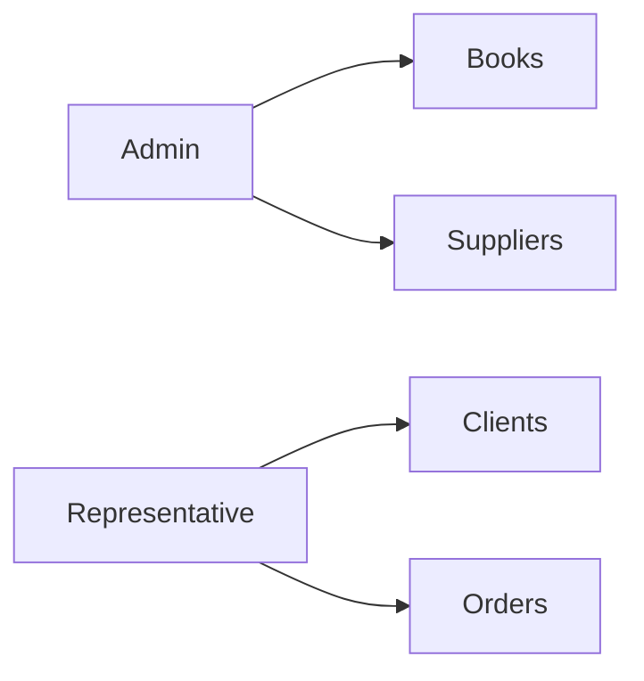

# Application Analysis & Documentation Generation Task

You are acting as a Senior Business Analyst, Software Architect, MERISE Expert, and Product Owner.

Your mission is to completely analyze this project and generate two documentation files:

* `generated_ai/MERISE.md`
* `generated_ai/CahierDeCharge.md`

The objective is NOT to document the code.

The objective is to document the APPLICATION, its BUSINESS RULES, its BEHAVIOR, its WORKFLOWS, and its DATA FLOW.

---

## PHASE 1 — APPLICATION DISCOVERY

Before generating any documentation:

1. Explore the entire project.

2. Identify:

   * Frontend pages
   * Routes
   * APIs
   * Database models
   * Services
   * User roles
   * Business workflows
   * Forms
   * Reports
   * Dashboards
   * Settings
   * Relationships between modules

3. Ignore implementation details whenever possible.

Focus on:

* What the application does.
* Why it exists.
* How users interact with it.
* How information moves through the system.

---

## PHASE 2 — GENERATE generated_ai/MERISE.md

Create a complete MERISE analysis document.

Use Mermaid diagrams for every diagram.

The document must contain:

### 1. Project Overview

* Application purpose
* Main objectives
* Main actors
* System boundaries

---

### 2. Actor Analysis

For each actor:

* Responsibilities
* Permissions
* Accessible modules

Examples:

* Administrator
* Representative
* Supplier
* Client
* System

---

### 3. Functional Decomposition

Break the application into modules.

Example:

* Authentication
* Books
* Suppliers
* Representatives
* Clients
* Billing
* Deliveries
* Deposits
* Reimbursements
* Reporting
* Settings
* Emailing
* Robots

---

### 4. Use Case Diagram

Generate Mermaid use case diagram.

Example:

---

### 5. Business Process Analysis

For each important workflow:

Create:

* Description
* Trigger
* Inputs
* Outputs
* Validation Rules

Examples:

* Create Delivery Note (BL)
* Create Client Sale
* Register Reimbursement
* Generate Invoice
* Declare Deposit
* Order Communication Notebook
* Order Business Cards

---

### 6. Data Flow Diagrams (DFD)

Level 0

Level 1

Level 2 when necessary

Use Mermaid.

---

### 7. Conceptual Data Model (MCD)

Generate complete MERISE MCD.

Include:

* Entities
* Attributes
* Relationships
* Cardinalities

Use Mermaid ER diagrams.

---

### 8. Logical Data Model (MLD)

Generate:

* Tables
* Keys
* Relationships

Use Mermaid ER diagrams.

---

### 9. Physical Data Model (MPD)

Generate:

* Final database structure
* Constraints
* Foreign keys
* Index recommendations

---

### 10. State Diagrams

For entities having lifecycle:

Examples:

* Invoice
* Delivery Note
* Reimbursement
* Deposit

Use Mermaid state diagrams.

---

### 11. Sequence Diagrams

Generate sequence diagrams for major workflows.

Examples:

* Login
* Delivery Creation
* Invoice Validation
* Deposit Validation

Use Mermaid.

---

### 12. Dependency Analysis

Describe:

* Module dependencies
* Cross-module interactions
* Critical coupling points

---

### 13. Risk Analysis

Identify:

* Missing modules
* Missing APIs
* Incomplete workflows
* Broken dependencies
* Business risks

---

### 14. Improvement Recommendations

Provide:

* Functional improvements
* UX improvements
* Business improvements
* Scalability recommendations

---

## PHASE 3 — GENERATE generated_ai/CahierDeCharge.md

This document must focus on SYSTEM BEHAVIOR.

Do NOT describe code.

Describe how the application should behave.

---

### 1. Executive Summary

Purpose of the application.

Main business goals.

---

### 2. User Roles

For each role:

* Permissions
* Restrictions
* Responsibilities

---

### 3. Functional Requirements

For every module:

Describe:

* Goal
* Features
* Inputs
* Outputs
* Business rules

---

### 4. Detailed User Stories

Format:

#### User Story

As a [role]

I want [action]

So that [benefit]

#### Acceptance Criteria

* ...
* ...
* ...

---

### 5. Business Rules

Document all discovered business rules.

Examples:

* A BL must belong to a season.
* An invoice cannot be validated without items.
* A reimbursement cannot exceed remaining credit.
* Deposits must reference a representative.

---

### 6. Application Behavior

For every screen:

Describe:

* Purpose
* Actions
* Expected reactions
* Error handling
* Validation rules

---

### 7. Database Evolution Rules

This section is extremely important.

Explain how the application must behave when the database changes.

For each case:

#### New Column

* Impact analysis
* Migration requirements
* Backward compatibility requirements

#### Column Removal

* Validation procedure
* Impact detection
* UI consequences

#### Table Addition

* Required integration process

#### Table Removal

* Dependency verification
* Data preservation strategy

#### Relationship Changes

* Validation process
* Migration strategy

---

### 8. Conflict Resolution Rules

Describe expected behavior when:

* Data inconsistency exists
* Referential integrity fails
* Duplicate records appear
* Missing foreign keys exist
* API returns unexpected data
* Concurrent updates occur

For every conflict provide:

* Detection method
* User experience
* Resolution strategy

---

### 9. Error Handling Policy

Describe:

* Validation errors
* Permission errors
* API failures
* Network failures
* Database failures

For each:

* User message
* Logging requirement
* Recovery strategy

---

### 10. Security Requirements

Describe:

* Authentication
* Authorization
* Session management
* Data access restrictions

---

### 11. Non-Functional Requirements

Describe:

* Performance
* Scalability
* Availability
* Maintainability
* Auditability

---

### 12. Missing Features

Based on repository analysis:

* Missing pages
* Missing APIs
* Missing workflows
* Missing business logic

Provide detailed recommendations.

---

## OUTPUT REQUIREMENTS

1. Create:

generated_ai/MERISE.md

generated_ai/CahierDeCharge.md

1. Use Mermaid for ALL diagrams.

2. Never describe code implementation unless absolutely necessary.

3. Focus on:

   * business logic
   * user workflows
   * system behavior
   * decision rules
   * application lifecycle

4. Infer missing business logic from existing pages, routes, APIs, database models, services, and documentation.

5. Use the audit document as a primary source of truth, but validate findings against the actual repository structure.

6. If inconsistencies are found:

   * document them
   * explain impacts
   * propose a resolution

7. Produce enterprise-grade documentation suitable for:

   * developers
   * project managers
   * business analysts
   * future maintainers
